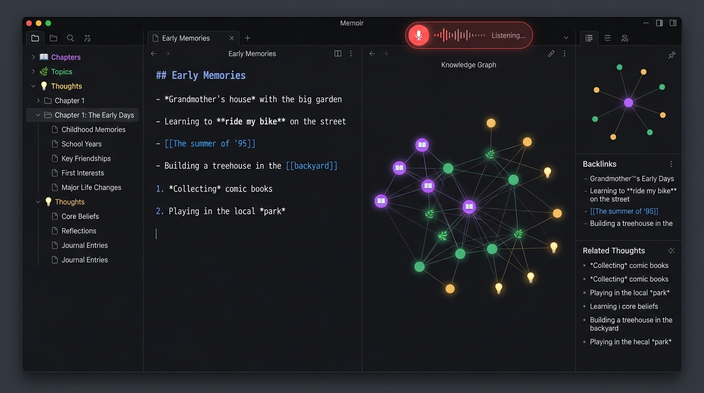
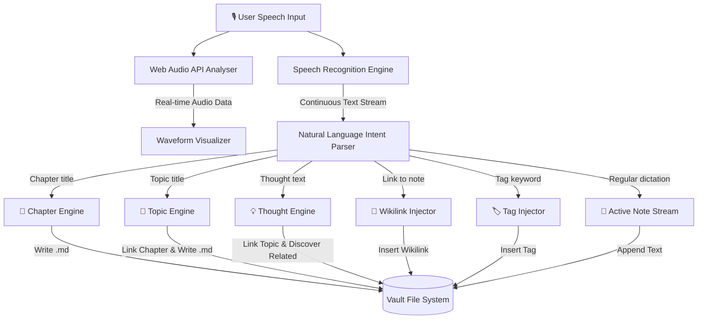
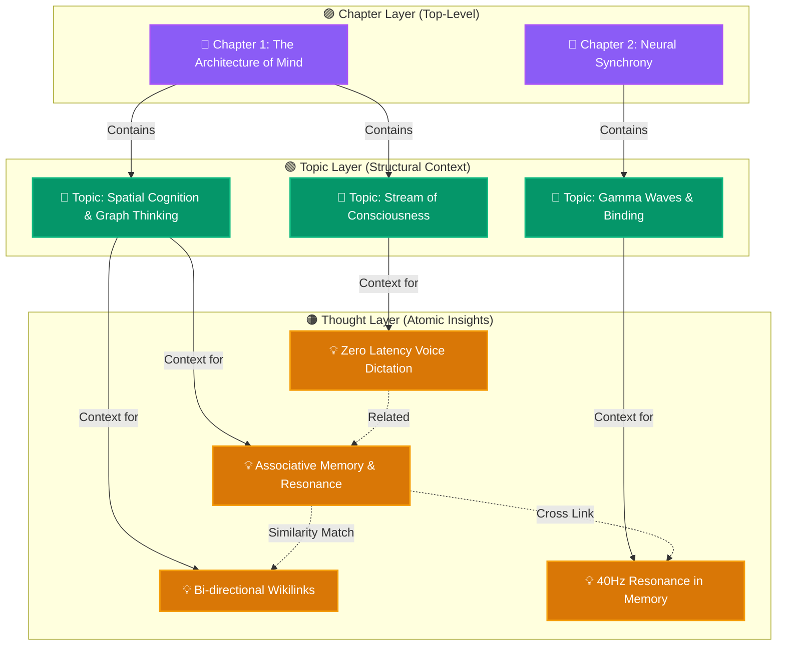

# 🧠 Memoir — Voice-Driven Connected Thought Vault

[](https://opensource.org/licenses/MIT)
[](https://obsidian.md)
[](https://www.python.org/)
[]()

**Memoir** is a local voice transcription application and connected knowledge graph vault inspired by **Obsidian**. It captures your stream of consciousness in real time hands-free, automatically parsing structural voice commands to build an interconnected Markdown knowledge base of **Chapters**, **Topics**, and **Thoughts**.

---

## 📸 Interface Preview



---

## 🏗️ System Architecture

Memoir operates entirely on your local machine with zero external cloud dependencies. Below is the end-to-end data flow and structural topology:

### 1. Voice Processing & Intent Recognition Pipeline



---

### 2. Knowledge Graph Topology & Relational Hierarchy



---

### 3. Application Stack & Component Breakdown

| Layer | Component | Implementation |
| :--- | :--- | :--- |
| **Frontend UI** | Obsidian-Style Layout | Semantic HTML5, Glassmorphism, CSS Custom Properties |
| **Voice Engine** | Speech-to-Text & Audio | Web Speech API, Web Audio API Analyzer, Synthesizer Chimes |
| **Graph Simulation** | Interactive Knowledge Graph | 2D HTML5 Canvas, 60fps N-Body Repulsion, Hooke Spring Physics |
| **Editor & Live Preview** | Markdown & Backlinks | Regex Parser, Wikilink Autocomplete `[[]]`, Frontmatter YAML |
| **Similarity Engine** | Related Thoughts Discovery | Jaccard Token Resonance & Tag Overlap Heuristics |
| **Backend & Storage** | Local REST API & Vault | Python 3 Standard Library HTTP Server, Pure Markdown (`.md`) |

---

## ✨ Key Features

- **🎙️ Live Transcription Review & Save / Discard Console**:
  - Review transcribed speech in real-time before committing it to your notes.
  - **Save to Note** (or <kbd>Ctrl</kbd>+<kbd>Enter</kbd>): Appends the reviewed text directly to the active note.
  - **Save as Thought / Topic / Chapter**: 1-click conversion of spoken text into structured knowledge nodes.
  - **Discard** (or <kbd>Esc</kbd>): Immediately clears the transcription buffer without altering files.
  - **Review Mode vs Auto-Stream Toggle**: Switch between explicit confirmation or direct auto-dictation.
- **🗣️ Natural Voice Commands**:
  - Say **"Chapter [Title]"** to start a new Chapter document.
  - Say **"Topic [Title]"** to create a Topic linked to the active Chapter.
  - Say **"Thought [Text]"** to create an atomic Thought note linked to topics and related thoughts.
  - Say **"Link to [Note]"** to insert `[[Note Name]]` wikilinks.
  - Say **"Tag [Keyword]"** to add `#keyword` tags.
  - Say **"Save transcription" / "Accept"** to save current speech into the active note hands-free.
  - Say **"Discard" / "Cancel"** to clear the transcription buffer hands-free.
- **🌐 Obsidian-Grade Interactive Knowledge Graph**:
  - Color-coded glowing halos (🟣 Chapters, 🟢 Topics, 🟠 Thoughts).
  - Hover tooltip cards showing word count, connection statistics, and note excerpts.
  - Drag, zoom, pan, search filtering, and node click-to-edit.
- **📝 Markdown Editor & Live Preview**:
  - Split view with live syntax styling, checklists, and code formatting.
  - Interactive `[[wikilinks]]` with auto-complete dropdown when typing `[[`.
  - Automatic note title renaming with global wikilink refactoring.
- **🔍 Semantic Related Thoughts Inspector**:
  - Discovers unexpected connections between thoughts across the vault.
  - 1-click **"+ Link in Note"** button.
- **📁 100% Local & Obsidian-Compatible**:
  - All notes are saved directly as `.md` files in `~/memoir/vault/`.
  - Open `vault/` directly in Obsidian, Logseq, or Foam.
  - 1-click **Export Vault as .zip**.

---

## 🚀 Quick Start

### 1. Launch Memoir
Run the launcher script:
```bash
/home/tomg/memoir/run.sh
```

Or start the server directly:
```bash
python3 /home/tomg/memoir/app.py
```

Open your browser at:
```
http://localhost:5432
```

---

## 🎙️ Voice Command Cheat Sheet

| Voice Phrase | Action | Resulting Markdown |
| :--- | :--- | :--- |
| **"Chapter The Quantum Mind"** | Starts a new Chapter | `vault/chapters/Chapter - The Quantum Mind.md` |
| **"Topic Wave Function Collapse"** | Creates a Topic linked to Chapter | `vault/topics/Topic - Wave Function Collapse.md`<br>`chapter: "[[Chapter - The Quantum Mind]]"` |
| **"Thought Superposition in biology"** | Creates an atomic Thought | `vault/thoughts/Thought - Superposition in biology.md`<br>`[[Topic - Wave Function Collapse]]` + Related Thoughts |
| **"Save transcription"** / **"Accept"** | Saves current speech to note | Inserts reviewed transcription buffer into note |
| **"Discard"** / **"Cancel"** | Discards current speech | Clears transcription review buffer |
| **"Link to Associative Memory"** | Inserts a wikilink | `[[Thought - Associative Memory]]` |
| **"Tag neuroscience"** | Adds a tag | `#neuroscience` |
| **"New line"** / **"New paragraph"** | Formatting | Inserts `\n` or `\n\n` |
| **"Bullet point key observation"** | List item | `- key observation` |
| **"Stop recording"** | Microphone control | Stops voice listening |

---

## ⌨️ Keyboard Shortcuts

| Shortcut | Action |
| :--- | :--- |
| <kbd>Ctrl</kbd> + <kbd>M</kbd> | Toggle Voice Recording / Transcription |
| <kbd>Ctrl</kbd> + <kbd>Enter</kbd> | Save transcription buffer into active note |
| <kbd>Esc</kbd> | Discard transcription buffer |
| <kbd>Ctrl</kbd> + <kbd>1</kbd> | Switch to Full Knowledge Graph View |
| <kbd>Ctrl</kbd> + <kbd>2</kbd> | Switch to Markdown Editor View |
| <kbd>Ctrl</kbd> + <kbd>3</kbd> | Switch to Split View (Editor + Graph) |
| <kbd>Ctrl</kbd> + <kbd>I</kbd> | Toggle Inspector & Local Graph Right Panel |
| <kbd>Ctrl</kbd> + <kbd>S</kbd> | Save Current Note |
| <kbd>?</kbd> | Open Voice Command Reference Modal |

---

## 📂 Vault Directory Structure

```
memoir/
├── app.py                 # Python backend REST server & vault manager
├── run.sh                 # 1-click startup script
├── memoir.desktop         # Linux desktop entry
├── assets/                # Screenshot and UI assets
│   └── screenshot.png     # Application screenshot
├── static/                # Obsidian-style web app (HTML, CSS, JS)
│   ├── css/
│   │   ├── style.css      # Core design system & Obsidian dark theme
│   │   └── graph.css      # Knowledge graph canvas & controls
│   ├── js/
│   │   ├── app.js         # Main application controller
│   │   ├── editor.js      # Markdown editor & wikilink autocomplete
│   │   ├── graph.js       # 2D Canvas force-directed graph simulation
│   │   ├── link_engine.js # Semantic similarity & inspector engine
│   │   ├── storage.js     # REST API client & cache sync
│   │   ├── voice.js       # Web Speech API & voice command parser
│   │   └── exporter.js    # Vault export as zip & markdown downloader
│   └── index.html         # Single-page application shell
└── vault/                 # Real Markdown Knowledge Vault
    ├── chapters/          # 📖 Top-level Chapter notes (.md)
    ├── topics/            # 🌿 Connected Topic notes (.md)
    └── thoughts/          # 💡 Atomic Thought notes (.md)
```

---

## 🛡️ License

MIT License — free to use, modify, and distribute.
